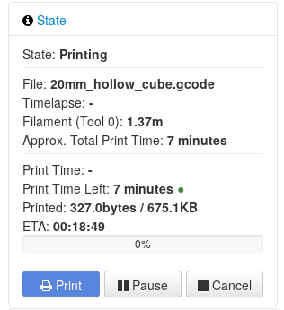

# OctoPrint-Display-Print-ETA

Display the finish time of the current print as estimated by Octoprint. The day of finish is displayed only when the current print will not finish today.
You can configure if you want to display the ETA on the printer, as well as if you want to use 12HR or 24HR time.
If this plugin causes your printer to report errors, try enabling the option "remove all colons"



## Setup

Install via the bundled [Plugin Manager](https://github.com/foosel/OctoPrint/wiki/Plugin:-Plugin-Manager)
or manually using this URL:

    https://github.com/AlexVerrico/Octoprint-Display-ETA/archive/master.zip

You must have the time zone configured on the host, otherwise you will see the time in UTC.
In Debian, use the following command to set time zone:
```bash
sudo dpkg-reconfigure tzdata
```
then follow the wizard.

Day and time are printed according to the host locales.
In Debian they are configured using
```bash
sudo dpkg-reconfigure locales
```
then follow the wizard.
